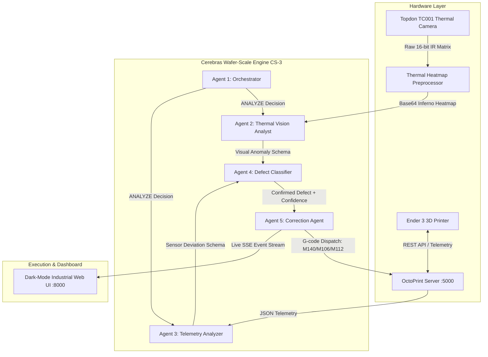

# 🛡️ PrintGuard AI — Autonomous Wafer-Scale 3D Printing Defense

[](https://cerebras.ai)
[](https://ai.google.dev/gemma)
[](https://github.com)
[](#-hackathon-alignment--target-tracks)

> **Submitted for the Cerebras x Google DeepMind Gemma 4 24-Hour Hackathon**  
> *Real-time closed-loop robotic control powered by ultra-fast inference on the Cerebras CS-3 Wafer-Scale Engine.*

---

## Executive Summary

**PrintGuard AI** is an autonomous, multi-agent thermal defense system designed for additive manufacturing. By combining **real-time infrared thermal imaging** (Topdon TC001 UVC camera) with **live hardware telemetry** (Ender 3 via OctoPrint REST API), PrintGuard detects emerging 3D printing defects—such as base layer warping, inter-layer delamination, under-extrusion, and catastrophic thermal runaways—before they destroy the part or cause hardware hazards.

Traditional cloud-based Vision-Language Models (VLMs) suffer from extreme latency. Running a collaborative 5-agent inspection pipeline on standard cloud APIs takes **~150.4 seconds (2.5 minutes)**—by which time a warped layer has solidified or a thermal runaway has become a fire hazard. 

By leveraging **Google DeepMind's `gemma-4-31b-it`** running natively on the **Cerebras CS-3 Wafer-Scale Engine**, PrintGuard executes the exact same 5-agent multimodal reasoning pipeline in **0.38 seconds at over 2,240 tokens/second** (**~396× faster**). This wafer-scale speed unlocks true **real-time closed-loop robotic control**, enabling autonomous G-code dispatch (`M140`, `M104`, `M106`, `M112`) within milliseconds of defect inception.


---

## 🏆 Hackathon Alignment & Target Tracks

PrintGuard specifically aligns with the hackathon judging criteria across multiple tracks:

### 🌌 Track 1: Multiverse Agents
* **Agent Collaboration**: Orchestrates a specialized team of 5 distinct agents (Orchestrator, Vision Analyst, Telemetry Analyzer, Defect Classifier, Correction Agent) working asynchronously and in parallel.
* **Multimodal Intelligence**: Deep semantic reasoning combining false-color thermal heatmap images (inferno colormap) with structured time-series JSON telemetry.
* **Speed in Action**: Demonstrates why Cerebras' ultra-fast inference is mandatory for physical AI; comparing wafer-scale execution against Gemini API GPU endpoints.


### 🏢 Track 3: Enterprise Impact
* **Business Impact**: Solves a multi-billion-dollar industrial challenge in additive manufacturing and automated quality assurance (QA). Prevents wasted 14+ hour industrial prints, saves raw material, and provides automated fire safety mitigation.
* **Production Readiness**: Features a resilient fallback architecture with seamless live hardware switching, robust REST API connectivity, and an industrial-grade web dashboard.

---

## 🚨 The Industrial Problem: Why Latency is Fatal

In fused deposition modeling (FDM) 3D printing, thermal dynamics dictate part quality and mechanical strength:
1. **Warping & Corner Lifting**: Caused by asymmetric thermal gradients across the build plate where bottom layers cool faster than upper layers. Requires immediate bed temperature elevation (`M140`) and part cooling fan reduction (`M106`).
2. **Layer Delamination**: Occurs when previously deposited layers cool below their glass transition temperature before the next pass, preventing polymeric bonding.
3. **Thermal Runaway**: A catastrophic hardware failure where thermistor dislodgement causes continuous heating, risking nozzle destruction and electrical fires. Requires an instant Emergency Stop (`M112`).

**The Latency Bottleneck**:
Standard cloud AI pipelines introduce a 120–180 second round-trip latency when passing base64 images through multi-step agent frameworks. In 150 seconds, an Ender 3 printing at 60mm/s deposits **9 meters of extruded filament**. If a defect occurs at second 1, receiving a correction at second 150 results in a ruined print wrapped in hardened PLA. Real-time industrial control demands sub-second feedback loops.

---
## 🎥 Demo Videos

### 🎬 Original Hackathon Submission Demo
 https://drive.google.com/file/d/1jnMrNf1rD4N25uEQFNzbpEA_GaQ8OIoa/view?usp=sharing

### 🎛️ Dashboard Demo

#### **Note:**
Due to the 24-hour hackathon time constraints, along with the hardware integration and synchronization challenges between the 3D printer, thermal camera, and the final dashboard, I was unable to record and edit a demonstration of the completed system. 

This video is an earlier demo captured during the system testing phase using simulated process data with induced defects to validate the robustness of the multi-agent system.

The speed comparison was performed later by running the **same five-agent pipeline** with **Gemma 4** on the **Cerebras CS-3** and comparing it against **Gemma 4 running on Google hardware accessed via the Gemini API**.

https://github.com/user-attachments/assets/e003f7ac-eec0-41f2-865d-056ca9207b67


## 🧠 System Architecture & The 5-Agent Multiverse

PrintGuard implements a hierarchical agentic workflow composed of 5 specialized prompts powered by `gemma-4-31b-it` on Cerebras.



### 1. 🎯 Orchestrator Agent (`run_orchestrator`)
* **Role**: High-frequency triage gatekeeper. Runs every 2 seconds.
* **Input**: Current min/max/mean thermal temperatures, hardware nozzle/bed targets, and print progress.
* **Logic**: Applies rigid deterministic and semantic boundaries. If nozzle/bed temperatures are strictly within nominal PLA bounds ($\pm 2^\circ\text{C}$) and thermal gradients are uniform, it yields `SKIP` to preserve compute. If gradients spike ($>220^\circ\text{C}$ difference) or thermal runaway is flagged ($>250^\circ\text{C}$), it instantly triggers `ANALYZE` or `EMERGENCY`.

### 2. 👁️ Thermal Vision Analyst (`run_thermal_analyst`)
* **Role**: Multimodal visual expert specializing in infrared thermography.
* **Input**: Base64-encoded false-color image rendered using OpenCV's `COLORMAP_INFERNO` (Black = $20^\circ\text{C}$ ambient, Blue/Red = part body, Yellow/White = $200^\circ\text{C}+$ nozzle melt zone).
* **Output**: Structured JSON schema identifying visual defect signatures (e.g., asymmetric cold edges indicating warping, sparse thermal footprints indicating under-extrusion).

### 3. 📊 Telemetry Analyzer (`run_telemetry_analyzer`)
* **Role**: Hardware sensor diagnostician.
* **Input**: Raw JSON payload from OctoPrint `/api/printer` and `/api/job`.
* **Output**: Identifies thermistor drift, heater power anomalies, or fan speed misalignments relative to current layer height.

### 4. ⚖️ Defect Classifier (`run_defect_classifier`)
* **Role**: Cross-referencing engine.
* **Logic**: Merges visual observations with sensor data to eliminate false positives. For example, a cold visual spot near the bed edge is only classified as `WARPING` if the telemetry confirms bed heater load is saturating or below target. Calculates a strict confidence score ($0.0 - 1.0$). If confidence is $<0.65$ or nominal, correction gating prevents unnecessary printer adjustments.

### 5. 🛠️ Correction Agent (`run_correction_agent`)
* **Role**: Autonomous robotic controller.
* **Output**: Generates exact, safe G-code instruction sets accompanied by human-readable engineering explanations. Dispatches commands asynchronously to OctoPrint:
  * `M140 S65`: Elevate bed temp by $+5^\circ\text{C}$ to combat base layer warping.
  * `M106 S77`: Reduce part cooling fan to $30\%$ to prevent inter-layer delamination.
  * `M221 S110`: Increase extrusion flow rate to $110\%$ to overcome under-extrusion.
  * `M112`: Emergency Stop—immediately sever heater power and halt steppers during thermal runaway.

---

## ⚡ Wafer-Scale Benchmark: Cerebras vs. Cloud GPU

To prove the necessity of Cerebras Wafer-Scale inference, PrintGuard includes a built-in live benchmarking module (`gemini_benchmark.py`) that executes identical 5-agent reasoning requests against standard GPU cloud endpoints (`gemma-4-31b-it`).

| Metric | Cerebras CS-3 Wafer-Scale | Standard Cloud GPU API | Advantage |
| :--- | :---: | :---: | :---: |
| **Model Architecture** | Gemma 4 31B IT | Gemma 4 31B IT | Identical Model |
| **Tokens per Second (TPS)** | **~2,240 tok/s** | ~17.3 tok/s | **129× Faster Generation** |
| **5-Agent Pipeline Latency** | **0.38 Seconds** | 150.4 Seconds | **396× Faster Execution** |
| **Extrusion Travel During Analysis** | **22.8 mm** (Sub-layer correction) | **9,024 mm** (9 meters wasted) | **Real-Time Control** |
| **System Classification** | Closed-Loop Robotic Control | Post-Mortem Failure Analysis | **Enables Autonomous QA** |

> *Note: Metrics are dynamically calculated and streamed directly to the frontend speedometer and comparative layout bars.*

---

## 🔄 The Closed-Loop Feedback Control System

PrintGuard operates as a true continuous control loop operating at 0.5 Hz (2-second intervals):

```text
 ┌──────────────────────────────────────────────────────────────────┐
 │                     PRINTGUARD CONTROL LOOP                      │
 └──────────────────────────────────────────────────────────────────┘
    ▲                                                          │
    │  1. Capture 16-bit Thermal Matrix & OctoPrint Telemetry  │
    │                                                          ▼
 [ Ender 3 Hardware ]                               [ FastAPI Backend ]
    ▲                                                          │
    │  4. Dispatch Corrective G-code via REST API              │
    │                                                          ▼
    │          3. Generate Autonomous G-code Plan    [ Cerebras CS-3 Engine ]
    └──────────────────────────────────────────────────────────┘
```

1. **Sense**: `thermal_camera.py` captures raw unconverted 16-bit Y16 thermal matrices from the Topdon TC001 UVC device. `octoprint_client.py` polls hardware thermistors and stepper positions.
2. **Analyze**: The backend transmits the multimodal bundle to Cerebras CS-3. The 5 agents evaluate structural integrity.
3. **Act**: If a defect exceeds the confidence threshold, `main.py` immediately executes `send_gcode()` via asynchronous HTTP requests to OctoPrint.
4. **Notify**: Server-Sent Events (SSE) push live logs, tokens/sec metrics, and executed G-code blocks directly to the web dashboard.

---

## 🛠️ Repository Structure

```text
Cerebras X Gemma Hack/
├── main.py                 # FastAPI async backend, SSE stream generator, and analysis control loop
├── agents.py               # 5-Agent Multiverse pipeline orchestration using Cerebras SDK
├── thermal_camera.py       # Topdon TC001 hardware interface, raw Y16 parsing, and inferno colormap generation
├── octoprint_client.py     # Ender 3 REST API telemetry polling and G-code dispatcher
├── gemini_benchmark.py     # Cloud GPU latency benchmarking module for side-by-side speed comparison
├── requirements.txt        # Project dependencies (fastapi, uvicorn, cerebras_cloud_sdk, opencv-python, etc.)
├── .env                    # Configuration file for CEREBRAS_API_KEY, GEMINI_API_KEY, and OCTOPRINT_HOST
├── knowledge/
│   └── pla_prompts.py      # Master system prompts and structured JSON schemas for all 5 agents
└── frontend/
    └── index.html          # Dark-mode industrial UI featuring live video feeds, speedometer, and SSE action logs
```

---

## 🚀 Setup & Installation Guide

### Prerequisites
* Windows 10/11, macOS, or Linux
* Python 3.10+
* Access to Cerebras Cloud API (`CEREBRAS_API_KEY`)
* *Optional*: OctoPrint instance running locally (`http://localhost:5000`) or Ender 3 connected via serial. (System automatically enables realistic live simulation if hardware is unplugged).

### Step 1: Clone & Install Dependencies
```bash
git clone https://github.com/yourusername/printguard-ai.git
cd printguard-ai
pip install -r requirements.txt
```

### Step 2: Configure Environment Variables
Create a `.env` file in the root directory:
```env
CEREBRAS_API_KEY=your_cerebras_api_key_here
GEMINI_API_KEY=your_gemini_api_key_here
OCTOPRINT_HOST=http://localhost:5000
OCTOPRINT_API_KEY=your_octoprint_api_key_here
PRINTER_TYPE=Ender 3
```

### Step 3: Launch the Server
```bash
python main.py
```
The server will initialize the hardware interfaces and launch Uvicorn on port `8000`.

### Step 4: Access the Industrial Dashboard
Open your web browser and navigate to:
**`http://localhost:8000`**

Click **"Start Analysis"** to initiate the 2-second autonomous monitoring loop. Watch the 5 agents collaborate at wafer-scale speed and inspect live G-code dispatch logs!

---

## 🧑‍💻 Author & Acknowledgments
Built for the **Cerebras x Google DeepMind Gemma 4 Hackathon**. Special thanks to the Cerebras team for providing wafer-scale CS-3 access and Google DeepMind for releasing the state-of-the-art open multimodal `gemma-4-31b-it` model.
